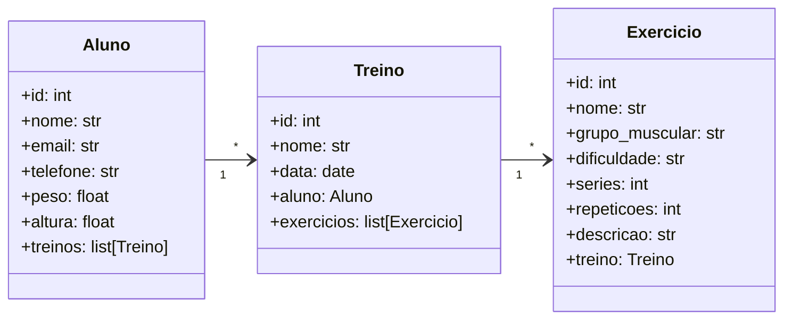

## Diagrama de Classes UML:

```mermaid
classDiagram
  direction LR
  
  class Aluno {
      +id: int
      +nome: str
      +email: str
      +telefone: str
      +peso: float
      +altura: float
      +treinos: list[Treino]
  }
  
  class Treino {
      +id: int
      +nome: str
      +data: date
      +aluno: Aluno
      +exercicios: list[Exercicio]
  }
  
  class Exercicio {
      +id: int
      +nome: str
      +grupo_muscular: str
      +dificuldade: str
      +series: int
      +repeticoes: int
      +descricao: str
      +treino: Treino
  }

  Aluno "1" --> "*" Treino
  Treino "1" --> "*" Exercicio

```
