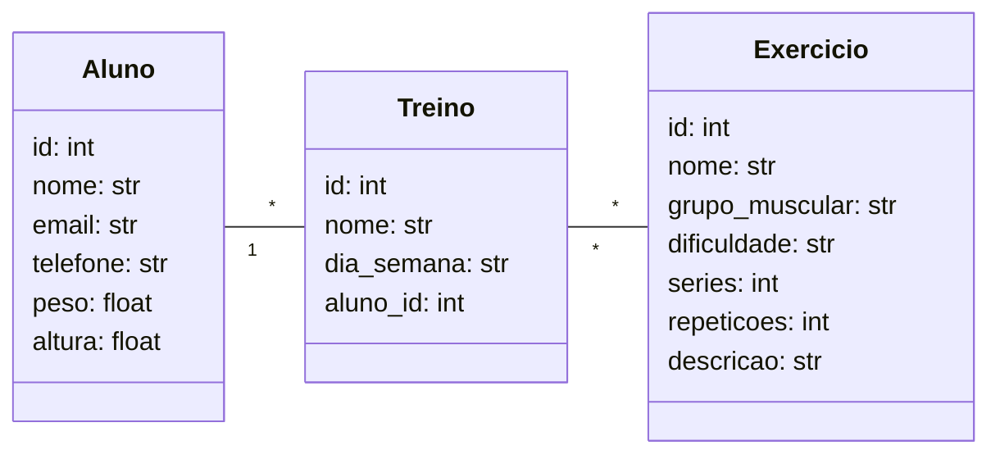

## Diagrama de Classes UML:

```mermaid
classDiagram
    direction LR
    class Aluno {
        id: int
        nome: str
        email: str
        telefone: str
        peso: float
        altura: float
    }
    class Treino {
        id: int
        nome: str
        dia_semana: str
        aluno_id: int
    }
    class Exercicio {
        id: int
        nome: str
        grupo_muscular: str
        dificuldade: str
        series: int
        repeticoes: int
        descricao: str
    }

    Aluno "1" -- "*" Treino
    Treino "*" -- "*" Exercicio
```
